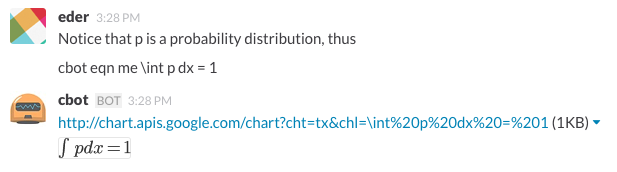

# hubot-equation

A hubot script that interacts with the Google Chat API to generate Latex
equations.



## Installation

In hubot project repo, run:

`npm install hubot-equation --save`

Then add **hubot-equation** to your `external-scripts.json`:

```json
[
  "hubot-equation"
]
```

## Usage
[robot] eqn me [your equation]

## TODO
- [ ] Detect double $ and generate equation inside automatically
- [ ] Hope for native equation support everywhere
